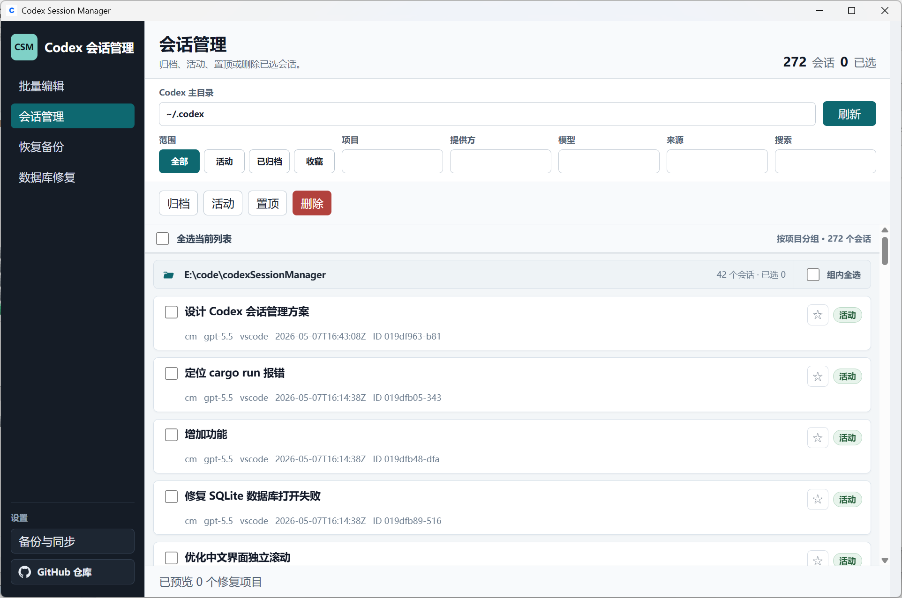
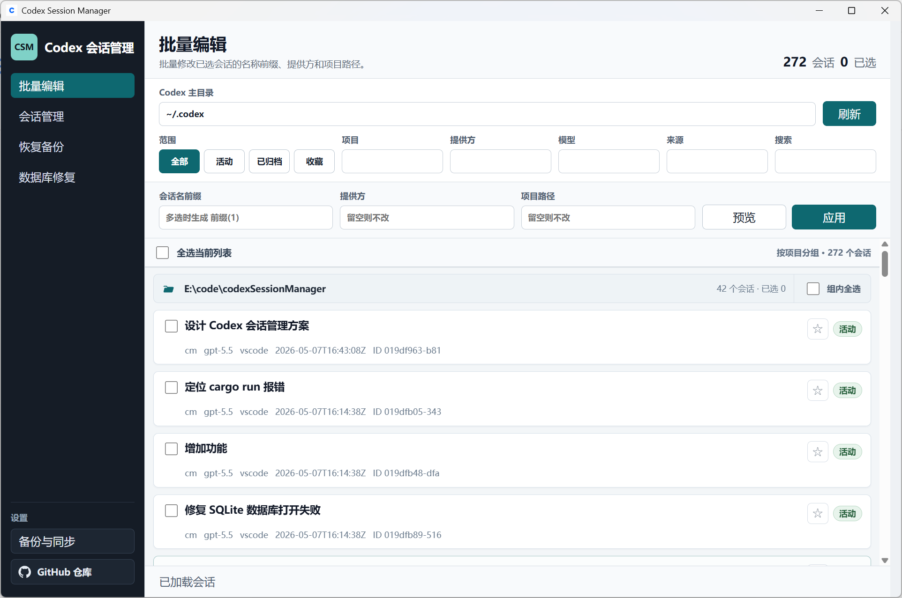
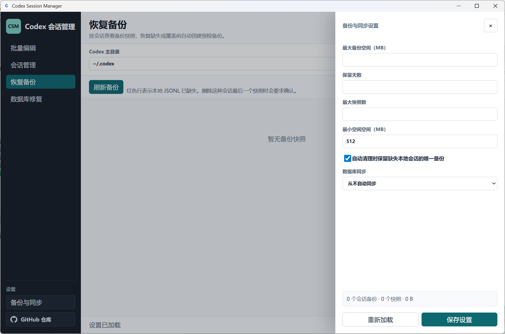
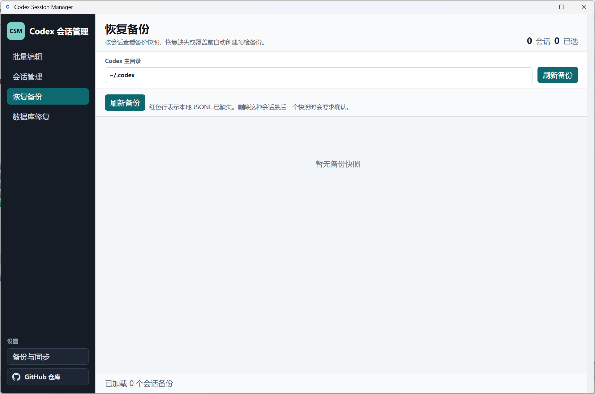
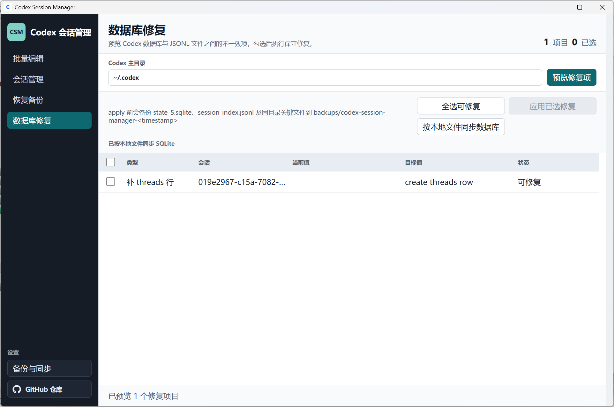

# Codex Session Manager

一个面向 OpenAI Codex 本地会话的桌面整理工具。它把分散在 `state_5.sqlite`、`sessions/`、`archived_sessions/` 和 `session_index.jsonl` 中的会话信息合并成一个可浏览、可筛选、可批量整理的界面。

如果你经常在多个项目里使用 Codex，遇到过会话列表混乱、旧会话难找、归档状态不一致、SQLite 索引和 JSONL 文件不同步等问题，这个工具可以帮你先看清本地数据，再谨慎地整理它。

[](LICENSE)
[](Cargo.toml)
[](src-tauri/tauri.conf.json)



## 核心能力

- 按项目分组浏览 Codex 本地会话，并保留项目展开状态。
- 按项目、提供方、模型、来源、归档状态、收藏状态和关键字筛选。
- 查看会话详情，包括标题、项目、模型、状态、更新时间、会话文件和索引状态。
- 批量编辑标题前缀、提供方和项目路径。
- 单个或批量归档、设为活动、置顶和删除到工具回收区。
- 收藏重点会话，并用收藏范围快速过滤。
- 管理会话级备份，按快照预览、恢复或删除备份。
- 预览并保守修复 SQLite 与 JSONL 之间的不一致。
- 按本地 JSONL 和 `session_index.jsonl` 手动同步 SQLite，也可配置为 Codex 停止后自动同步一次。
- 自动保存输入框内容、筛选条件和项目分组展开状态。

## 截图

| 会话管理 | 批量编辑 |
| --- | --- |
|  |  |

| 备份设置 | 数据备份 | 数据库修复 |
| --- | --- | --- |
|  |  |  |

## 下载和运行

已发布版本会通过 GitHub Actions 构建桌面安装包，并上传到仓库的 [Releases](https://github.com/aisspire/codexSessionManager/releases) 页面。当前 release workflow 会生成草稿 Release，维护者检查附件后再手动发布。

从源码运行桌面端需要：

- Rust stable 和 Cargo
- Node.js 20 或兼容版本
- npm
- Windows WebView2 Runtime
- Tauri 2 所需系统依赖

本地开发运行：

```powershell
npm --prefix ui ci
npm --prefix ui run tauri -- dev
```

构建前端：

```powershell
npm --prefix ui run build
```

打包桌面应用：

```powershell
npm --prefix ui run tauri -- build
```

## 快速上手

1. 打开应用后，确认顶部的 Codex 主目录。默认值是 `~/.codex`。
2. 点击刷新，应用会扫描本地 Codex 会话并按项目分组展示。
3. 使用顶部筛选栏缩小范围，例如按项目、模型、归档状态或关键字过滤。
4. 点击会话行查看详情，必要时编辑标题、项目或提供方。
5. 勾选单个会话或整个项目分组，然后执行归档、活动、置顶、删除或批量编辑。

常见 Codex 主目录示例：

```text
Windows: C:\Users\<用户名>\.codex
WSL:     /mnt/c/Users/<用户名>/.codex
Linux:   ~/.codex
```

更详细的日常操作说明见 [使用说明.md](使用说明.md)。

## 数据模型

Codex 的本地会话信息通常分散在这些位置：

```text
<CodexHome>/state_5.sqlite            会话状态、项目路径、归档状态、rollout_path 等索引信息
<CodexHome>/sessions/**/*.jsonl       活动会话正文和会话元信息
<CodexHome>/archived_sessions/*.jsonl 已归档会话文件
<CodexHome>/session_index.jsonl       最近会话标题和更新时间索引
```

Codex Session Manager 会把 SQLite 中的 threads、`sessions/` 和 `archived_sessions/` 中可解析的 rollout JSONL、以及 `session_index.jsonl` 合并为一个列表视图。列表数量可能大于直接查询 SQLite threads 的数量，这通常表示有些会话只存在于 JSONL 文件中，但仍然可以被识别。

本项目把本地 JSONL 和 `session_index.jsonl` 视为主要事实来源，`state_5.sqlite` 视为可修复的辅助索引。只要本地文件证据足够明确，工具就可以从 JSONL 和索引反向修复或同步 SQLite。

## 安全和隐私

这个工具操作的是本机 Codex 数据，不需要上传会话内容。项目代码中没有面向远端服务上传会话数据的流程；桌面端只允许打开本项目 GitHub 仓库这个外部链接。

写入行为遵循保守策略：

- 筛选、浏览、预览修复项不会修改 Codex 数据。
- 编辑会话元数据和删除会话前会自动创建会话级备份。
- 会话级备份保存在 `<CodexHome>/backups/codex-session-manager/sessions/<session_id>/`。
- 删除会把会话移动到工具回收区，不直接永久删除。
- 归档和取消归档会移动会话文件并更新索引，但不会自动创建会话级备份。
- 数据库修复写入前会备份 `state_5.sqlite`、`session_index.jsonl`，并尽量包含 SQLite 的 WAL/SHM 文件。
- 恢复备份如果会覆盖已有本地 JSONL，会先创建 `restore-preflight` 预检备份。
- 归档、活动、删除、数据库修复等写入操作会检测 Codex 是否正在运行；检测到同一份本地数据可能被占用时会拒绝写入。

建议在执行大批量整理、数据库修复或恢复操作前关闭正在使用同一份数据的 Codex。对于特别重要的数据，也可以先额外复制 `.codex` 中的关键文件。

## 主要工作流

### 会话整理

会话管理视图适合日常整理。你可以先用项目、模型、来源、归档状态和关键字缩小范围，再选择单个会话或整个项目分组。批量操作包括归档、设为活动、置顶、删除和元数据编辑。

归档会尽量把对应 rollout 文件从 `sessions` 移到 `archived_sessions`。设为活动会执行相反操作，并刷新 rollout 文件时间，帮助 Codex 或列表刷新逻辑感知变化。置顶只刷新文件访问时间和修改时间，不重写会话正文。

### 备份恢复

恢复备份页面按会话 ID 展示备份组，包括标题、项目、会话 ID、最新备份时间、快照数量和本地 JSONL 是否仍存在。红色备份行表示本地 JSONL 已缺失。

恢复备份会恢复 JSONL，合并缺失的 `session_index.jsonl` 条目，可选恢复收藏状态，并从恢复后的本地文件同步 SQLite。删除某个本地已缺失会话的最后一个备份快照时，界面会要求额外确认。

### 数据库修复

数据库修复用于处理 SQLite、JSONL 文件和 `session_index.jsonl` 之间的不一致。它默认先预览，不会立即写入。

可自动应用的保守修复包括：

- JSONL-only 会话：JSONL 存在但 SQLite `threads` 缺少对应行时，补充缺失行。
- `rollout_path` 修复：SQLite 中路径为空、不存在或不可用时，改为当前真实 JSONL 路径。
- 路径归一化：将不可用的 `/mnt/<盘符>/...` 路径修为当前系统可用路径。
- 归档状态同步：唯一 JSONL 位于 `archived_sessions` 时同步为已归档，位于 `sessions` 时同步为活动。

只报告、不自动修改的情况包括 SQLite-only row 和重复 JSONL，因为这些情况无法仅凭代码安全地判断应该保留哪份数据。

## CLI

仓库根目录同时提供一个 Rust CLI，适合做只读检查、脚本化预览或在没有桌面界面时执行明确命令。

查看帮助：

```powershell
cargo run -- --help
```

只读扫描：

```powershell
cargo run -- --codex-home C:\Users\<用户名>\.codex scan
```

列出会话：

```powershell
cargo run -- --codex-home C:\Users\<用户名>\.codex list --archived all
```

验证一致性：

```powershell
cargo run -- --codex-home C:\Users\<用户名>\.codex validate
```

列出备份：

```powershell
cargo run -- --codex-home C:\Users\<用户名>\.codex backup-list
```

会写入数据的 CLI 命令会显式要求 `--apply`。例如同步 SQLite：

```powershell
cargo run -- --codex-home C:\Users\<用户名>\.codex sync-database --apply
```

## 项目结构

```text
ui/          Vite + TypeScript 前端界面
src-tauri/   Tauri 2 桌面壳和前后端桥接
src/         Rust 核心逻辑与 CLI
tests/       Rust 集成测试和 PowerShell 发布脚本测试
assets/      README 和项目展示截图
```

桌面端前端负责列表、筛选、选择、详情面板和操作按钮。Tauri 桥接层把这些操作交给 Rust 核心执行。Rust 侧负责读取 Codex 本地状态、解析 rollout JSONL、移动归档文件、更新 SQLite 状态、更新索引、管理备份和执行安全检查。

## 开发

安装前端依赖：

```powershell
npm --prefix ui ci
```

运行前端构建检查：

```powershell
npm --prefix ui run build
```

运行 Rust 测试：

```powershell
cargo test
```

运行版本脚本测试：

```powershell
powershell.exe -NoProfile -ExecutionPolicy Bypass -File .\tests\set-version.tests.ps1
```

## 发布

发布流程由 `.github/workflows/release.yml` 驱动。推送 `v*` 格式的 tag 后，GitHub Actions 会构建并上传桌面安装包。

当前构建矩阵包括：

- Windows: `windows-latest`
- Linux: `ubuntu-22.04`
- macOS Apple Silicon: `aarch64-apple-darwin`
- macOS Intel: `x86_64-apple-darwin`

发布前用版本脚本同步版本号，参数不带 `v`：

```powershell
powershell.exe -NoProfile -ExecutionPolicy Bypass -File .\set-version.ps1 0.2.0
```

脚本会同步更新 `Cargo.toml`、`Cargo.lock`、`src-tauri/Cargo.toml`、`src-tauri/Cargo.lock`、`ui/package.json` 和 `ui/package-lock.json`。

建议发布前至少执行：

```powershell
powershell.exe -NoProfile -ExecutionPolicy Bypass -File .\tests\set-version.tests.ps1
npm --prefix ui run build
```

确认版本文件和构建检查没问题后，创建发布提交并推送 tag：

```powershell
git tag v0.2.0
git push origin v0.2.0
```

workflow 当前设置为 `releaseDraft: true`，生成的是草稿 Release。Actions 全部通过后，到 GitHub Releases 页面检查标题、说明和附件，再手动发布。

## 常见问题

### 列表为空怎么办？

先确认 Codex 主目录是否正确，再清空筛选条件，把状态切到全部并刷新。如果仍然为空，检查 `.codex` 下是否存在 `sessions/`、`archived_sessions/`、`state_5.sqlite` 或 `session_index.jsonl`。

### 为什么工具显示的会话数量比 SQLite threads 多？

这是预期行为。工具会合并 SQLite threads 和本地 rollout JSONL。只存在于 JSONL 中的会话也会尽量展示出来，需要时可以进入数据库修复预览并补齐 SQLite 行。

### 操作被拒绝怎么办？

通常是 Codex 正在使用同一份本地数据。关闭 Codex 后再重试。错误信息会保留失败原因，方便定位具体问题。

### 数据库修复会改写会话正文吗？

不会。数据库修复不会重写会话正文 JSONL，也不会删除 SQLite-only 行。它只补充或更新 SQLite 中可以保守确认的索引字段。

### 删除后还能恢复吗？

可以。删除前会自动创建会话级备份，并把会话移动到工具回收区。日常恢复建议使用“恢复备份”页面按会话和快照恢复。

## 支持

如果这个项目帮到了你，欢迎 star、反馈问题，或通过下面的链接支持作者：

[支持链接](https://aisspire.github.io/support/)

## License

[MIT](LICENSE)
